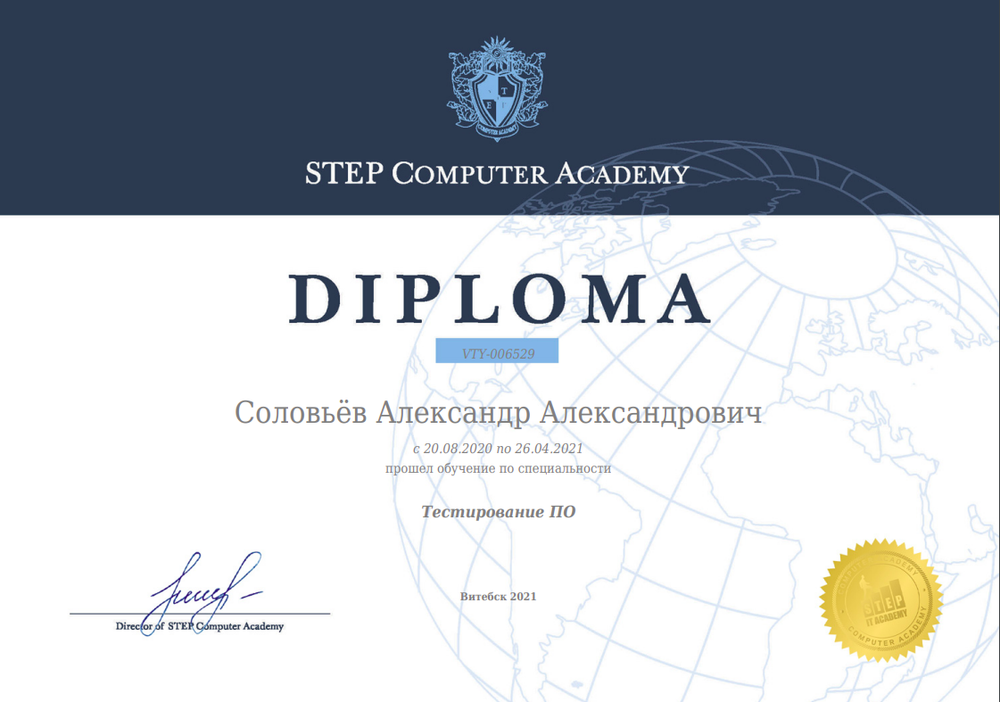

<h1 align="center">Hi there, I'm <a href="https://www.linkedin.com/in/aliaksandr-salauyou-1a5054204/">Aliaksandr</a> </h1>
<h3 align="center">QA/AQA engineer</h3>

### <h3 align="center">Education</h4>

<table width="100%" border='0'>
   <tr> 
    </td><td valign="middle">IT STEP  Academy   РУЧНОЕ И АВТОМАТИЗИРОВАННОЕ ТЕСТИРОВАНИЕ ПО  08.20 - 04.21.</td><td width="30%" valign="bottom"></tr>
    <tr><td valign="middle">TeachMeSkills  АВТОМАТИЗИРОВАННОЕ ТЕСТИРОВАНИЕ НА JAVA  09.21 - 03.22.</td><td width="30%" valign="bottom"></td>
   </tr>
  </table>
   

### Connect with me:

### Tools:

 

  

